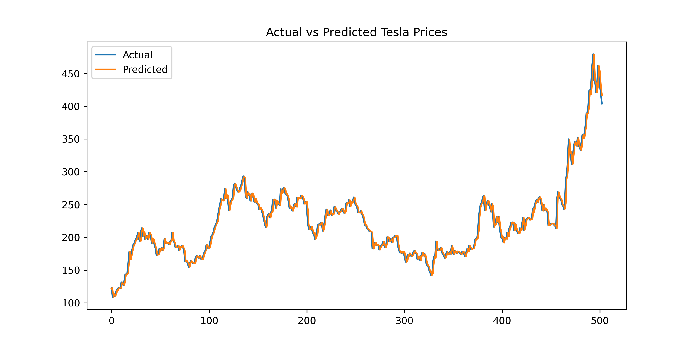

# Tesla-Stock-Price-Prediction
A beginner-friendly Machine Learning project that predicts Tesla (TSLA) stock prices using Python, yfinance API, Pandas, and Linear Regression. Includes data fetching, preprocessing, model training, evaluation, and visualization of actual vs predicted prices.


---


## 📌 Features  
- Fetches real stock market data (2015–2024)  
- Data cleaning and preprocessing  
- Linear Regression model for prediction  
- Train-test split  
- Actual vs Predicted graph visualization  
- Beginner-friendly end-to-end ML workflow  

---

## 🛠️ Tech Stack  
- Python  
- Pandas  
- NumPy  
- Matplotlib  
- yfinance  
- scikit-learn  

---



## 📥 Dataset  
The dataset is downloaded using yfinance:

```python
df = yf.download("TSLA", start="2015-01-01", end="2025-01-01")
